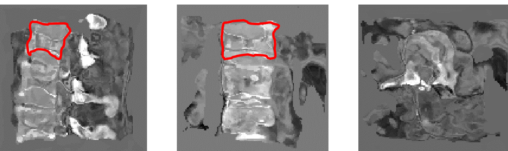

# voxelmorph-3D-generates-healthy-spine-CTs # 
Here we use the registration network [Voxelmorph](https://arxiv.org/abs/1809.05231) for generating healthy spine CTs from fractured spine CTs by registrating fractured spines with 
healthy atlases. This implementation is highly based on the [pytorch implementation](https://github.com/voxelmorph/voxelmorph/tree/master/pytorch) of the original authors.
### Prerequisites: ###
This implementation has been tested on Windows 10.1909 and the main components that need to be installed are:
* Python 3
* PyTorch 1.3.0
* torchvision 0.4.0
* nibabel 2.5.0
* tensorboardX
 
 

### Training on cluster: ###
 
**train on fractured data:**    `polyaxon run -f polyaxonfile_train_fractures.yaml -u -l`

 **train on healthy data:**     `polyaxon run -f polyaxonfile_train_healthy.yaml -u -l`
 
 
 ### Testing on cluster: ###
 For testing it is important to specify the direction of a trained model. The paramater `nr_val_data` (number of test samples)
 must be the same in the corresponding train and test run. Should better not be changed.
 
 **test on fractured data:**    `polyaxon run -f polyaxonfile_test_fractures.yaml -u -l`
 
 **test on healthy data:**      `polyaxon run -f polyaxonfile_test_healthy.yaml -u -l`
 
 
 
### Some results on the test data: ###

The images shows the middle slices (sagittal, coronal, axial) of the generated healthy volume, the newly generated vertebra marked red.
 
